

<a href="https://dapsdev.dev">
<picture>
  <source media="(prefers-color-scheme: dark)" srcset="assets/header-dark.svg">
  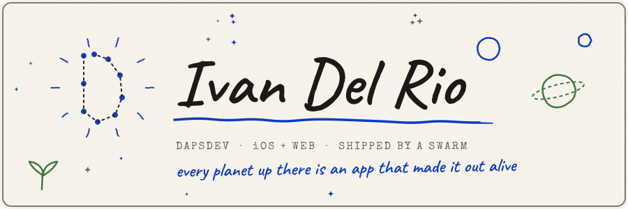
</picture>
</a>

 

<picture>
  <source media="(prefers-color-scheme: dark)" srcset="assets/divider-universe-dark.svg">
  
</picture>

<a href="https://dapsdev.dev">
<picture>
  <source media="(prefers-color-scheme: dark)" srcset="assets/orbit-map-dark.svg">
  
</picture>
</a>

<a href="https://dapsdev.dev/receiptify"><picture><source media="(prefers-color-scheme: dark)" srcset="assets/card-receiptify-dark.svg">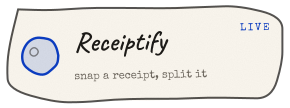</picture></a><a href="https://dapsdev.dev/cookedai"><picture><source media="(prefers-color-scheme: dark)" srcset="assets/card-cookedai-dark.svg">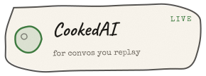</picture></a><a href="https://dapsdev.dev/souseye"><picture><source media="(prefers-color-scheme: dark)" srcset="assets/card-souseye-dark.svg">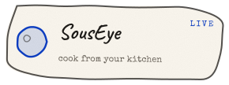</picture></a><a href="https://dapsdev.dev/gymrotter"><picture><source media="(prefers-color-scheme: dark)" srcset="assets/card-gymrotter-dark.svg">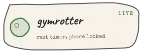</picture></a><a href="https://dapsdev.dev/cardmax"><picture><source media="(prefers-color-scheme: dark)" srcset="assets/card-cardmax-dark.svg">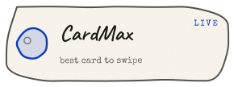</picture></a><a href="https://dapsdev.dev/yuckr"><picture><source media="(prefers-color-scheme: dark)" srcset="assets/card-yuckr-dark.svg">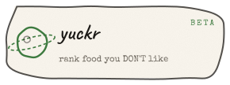</picture></a><a href="https://dapsdev.dev/bsscconnect"><picture><source media="(prefers-color-scheme: dark)" srcset="assets/card-bsscconnect-dark.svg">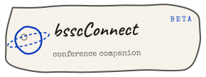</picture></a><a href="https://dapsdev.dev/chilish"><picture><source media="(prefers-color-scheme: dark)" srcset="assets/card-chilish-dark.svg">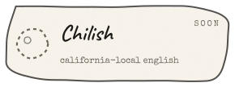</picture></a><a href="https://dapsdev.dev/keeper"><picture><source media="(prefers-color-scheme: dark)" srcset="assets/card-keeper-dark.svg">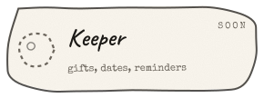</picture></a><a href="https://dapsdev.dev/strive75"><picture><source media="(prefers-color-scheme: dark)" srcset="assets/card-strive75-dark.svg">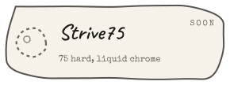</picture></a><a href="https://dapsdev.dev/relay"><picture><source media="(prefers-color-scheme: dark)" srcset="assets/card-relay-dark.svg">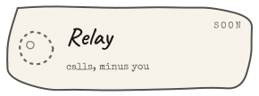</picture></a>

<picture>
  <source media="(prefers-color-scheme: dark)" srcset="assets/divider-how-dark.svg">
  
</picture>

I orchestrate fleets of AI agents and ship real apps in days.

<picture>
  <source media="(prefers-color-scheme: dark)" srcset="assets/divider-find-dark.svg">
  
</picture>

<b><a href="https://dapsdev.dev">dapsdev.dev</a></b> — the whole universe, in 3D 
<a href="https://dapsdev.dev/hire">dapsdev.dev/hire</a> — want one of these built for you?

<picture>
  <source media="(prefers-color-scheme: dark)" srcset="assets/oss-note-dark.svg">
  
</picture>

<a href="https://github.com/BariBariGood/simslim">simslim</a> — run ~4× more iOS simulators on one Mac by switching off the daemons they don't need &nbsp;·&nbsp; <a href="https://github.com/BariBariGood/releases">releases</a> — the DapsDev binaries, out in the open. 

  

<picture>
  <source media="(prefers-color-scheme: dark)" srcset="assets/footer-dark.svg">
  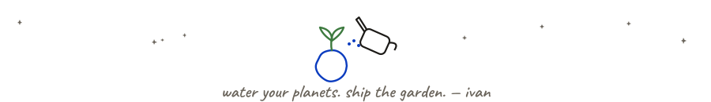
</picture>

